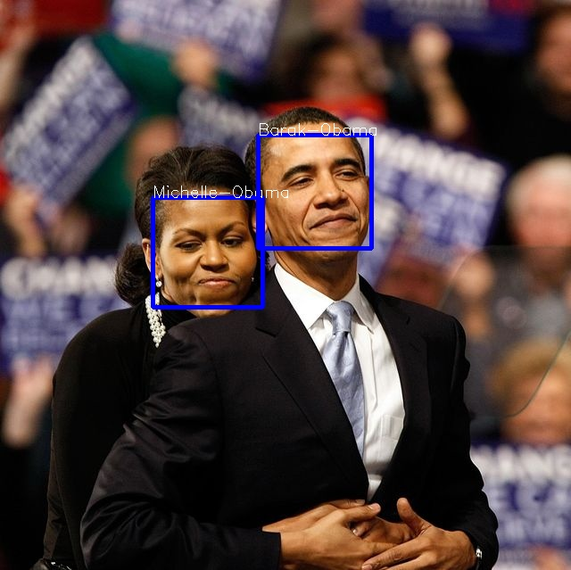

# 7-7 Face Recognition
Face recognition using python

- Framework: TensorFlow2 and Keras
- Backbone net: MobileNetV2 
- Face detector: MTCNN

## Performance
| Model | train Accuracy | test Accuracy |
|:-|:-:|
| Mobilenet0.25 | 99.22% | 92.50% |

## PreTrain Model
If you do not wish to train the model, we also provide trained model. Pretrain model and trained model are put in
[google drive](https://drive.google.com/drive/folders/1otgK5wd7axsLtDjvB2JcZ8xQ9kKLXZrj?usp=sharing)

## Train
1. Get dataset from [google drive](https://drive.google.com/drive/folders/1WGSotRtFPYGuxPEGkWWRsBPlVXFSvl7p?usp=sharing)
2. Run Face_Recognition_Train.ipynb

## Test
Evaluate the trained model using:
```
python inference_image.py --input input/obamas.jpg
python inference_video.py --input input/kim.mp4
```

